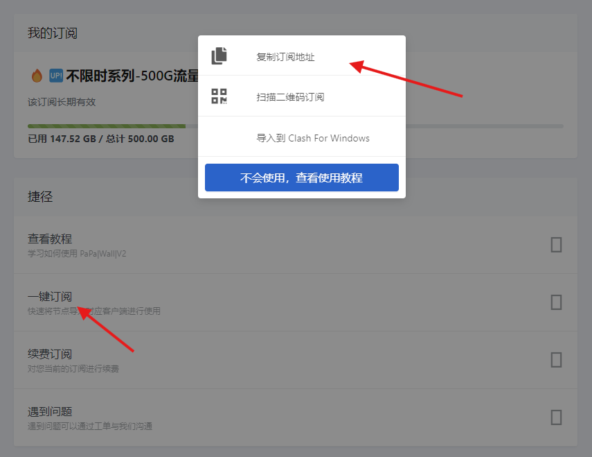
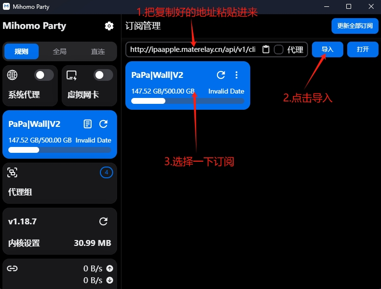
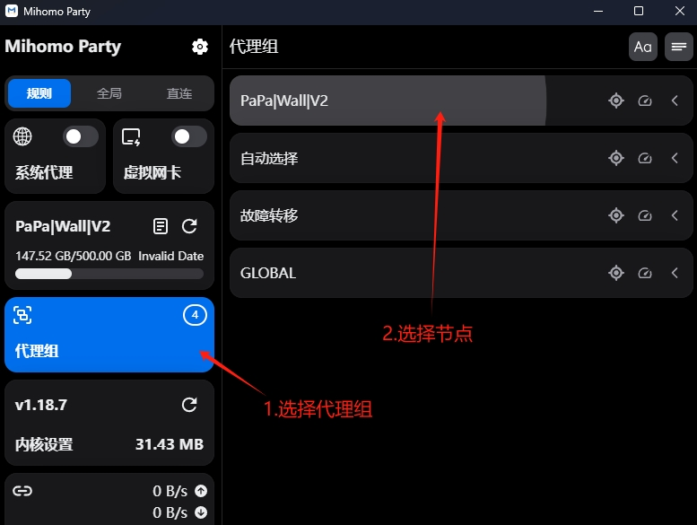
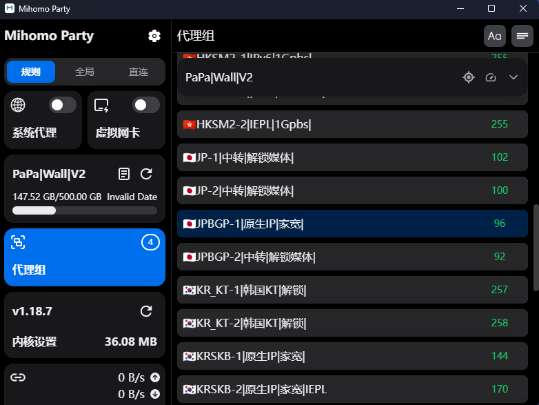
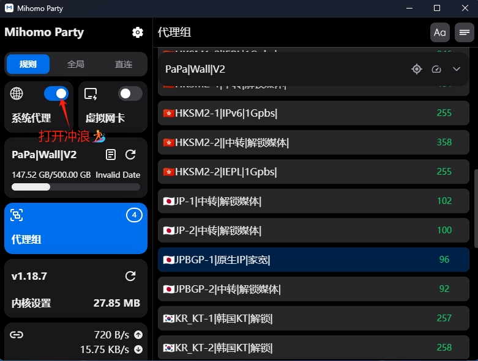

# Mihomo Party{ width="50" }教程
---

[右下角↘️联系客服 :fontawesome-solid-user-plus:{ .plane }](javascript:void(0);){: .md-button .md-button--primary #contact-support }

---

### 1️⃣:下载客户端
!!! tip "温馨提示"
    
    此客户端更新频繁,而且可以备份设置到你自己的WebDav 比较方便 与mac平台通用.
    
[:material-arrow-down:{ .plane } Win7_64位点此下载 :material-arrow-down:{ .plane }](https://down.papawall.cc/mp_windows7x32.exe){ .md-button }

[:material-arrow-down:{ .plane } Win7_32位点此下载 :material-arrow-down:{ .plane }](https://down.papawall.cc/mp_windows7x64.exe){ .md-button }

[:material-arrow-down:{ .plane } Win10_64位以上点此下载 :material-arrow-down:{ .plane }](https://down.papawall.cc/mp_windows10x64.exe){ .md-button }[^1] 

---

### 2️⃣:登录官网[^2] 

!!! warning "首先你需要注册好账户,购买好相应的订阅套餐,不然无法显示节点."

官网地址1 [https://papawall.pro](https://papawall.pro)

官网地址2 [https://papawall.lol](https://papawall.lol)

如遇打不开,请联系客服获取最新地址

    
---

### 3️⃣:对客户端进行设置
!!! note "登录官网以后复制好订阅地址 如下图"
<figure markdown="span">
{ width="600" }
  <figcaption>先复制一下订阅地址</figcaption>
</figure>

---

!!! note "打开软件进行配置."

<figure markdown="span">
{ width="600" }
  <figcaption>打开软件 粘贴订阅地址</figcaption>

{ width="600" }
  <figcaption>进行节点的选择</figcaption>
</figure>

---

!!! note "节点的选择由你自己的需求来决定,比如物理位置.延迟."

<figure markdown="span">
{ width="600" }
  <figcaption>进行节点的选择</figcaption>
</figure>

---
!!! example "打开系统代理后,就可以出国学习资料啦."
<figure markdown="span">
{ width="600" }
  <figcaption>打开系统代理开关</figcaption>

{ width="600" }
  <figcaption>可以开始网上冲浪拉!🏄‍</figcaption>
</figure>
----

## ❓连不上怎么办
    首先检查一下流量以及账户到期时间
    检查一下节点是否为超时,更换节点
    检查一下dns是否更改为
    IPv4 DNS
      - 119.29.29.29           (腾讯公共DNS)
      - 8.8.8.8                (谷歌公共DNS)
    IPv6 DNS
      - 2400:3200::1           (阿里公共DNS)
      - 2001:4860:4860::8888   (谷歌公共DNS)
!!! bug "90%的问题基本都可以解决,请仔细检查呀 如果解决不了请联系客服"

[^1]: 截止发稿为止客户端版本号为1.7.3 预计安装后会提示更新,直接更新即可.
[^2]: 官网地址 [https://papawall.pro](https://papawall.pro)